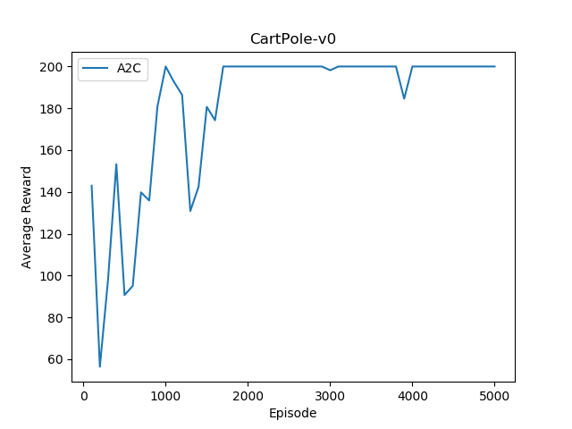
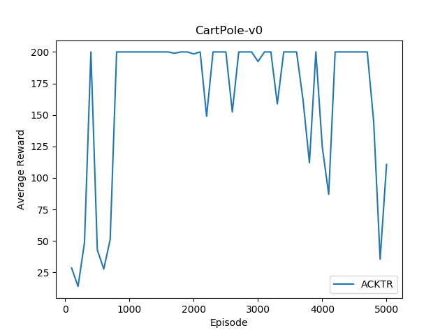
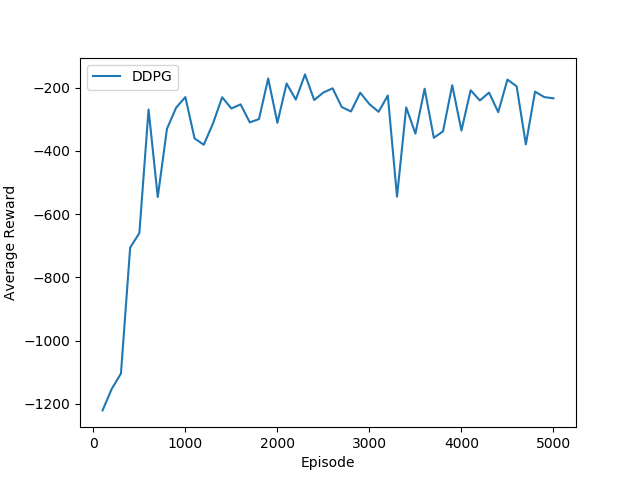
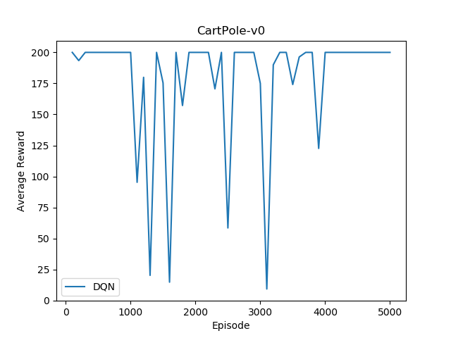
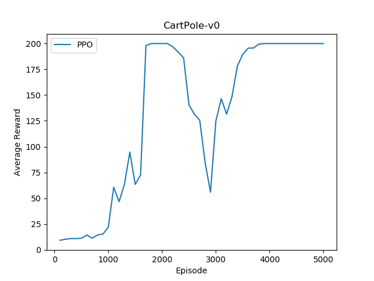

# pytorch-madrl

This project includes PyTorch implementations of various Deep Reinforcement Learning algorithms for both single agent and multi-agent.

- [ ] A2C
- [ ] ACKTR
- [ ] DQN
- [ ] DDPG
- [ ] PPO

It is written in a modular way to allow for sharing code between different algorithms. In specific, each algorithm is represented as a learning agent with a unified interface including the following components:
- [ ] interact: interact with the environment to collect experience. Taking one step forward and n steps forward are both supported (see `_take_one_step_` and `_take_n_steps`, respectively)
- [ ] train: train on a sample batch
- [ ] exploration_action: choice an action based on state with random noise added for exploration in training
- [ ] action: choice an action based on state for execution
- [ ] value: evaluate value for a state-action pair
- [ ] evaluation: evaluation the learned agent

# Requirements

- gym
- python 3.6
- pytorch

# Usage

To train a model:

```
$ python run_a2c.py

```

## Results
It's extremely difficult to reproduce results for Reinforcement Learning algorithms. Due to different settings, e.g., random seed and hyper parameters etc, you might get different results compared with the followings.

### A2C



### ACKTR



### DDPG



### DQN



### PPO




# TODO
- [ ] TRPO
- [ ] LOLA
- [ ] Parameter noise

# Acknowledgments
This project get inspirations from the following projects:
- [ ] Ilya Kostrikov's [pytorch-a2c-ppo-acktr](https://github.com/ChenglongChen/pytorch-a2c-ppo-acktr) (kfac optimizer is taken from here)
- [ ] OpenAI's [baselines](https://github.com/openai/baselines)
